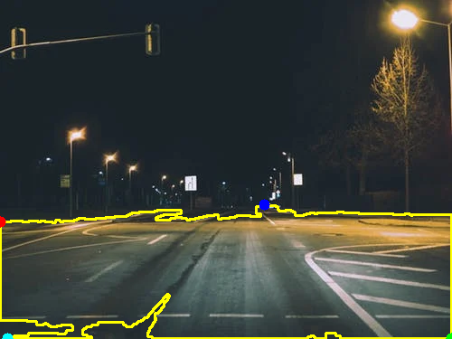
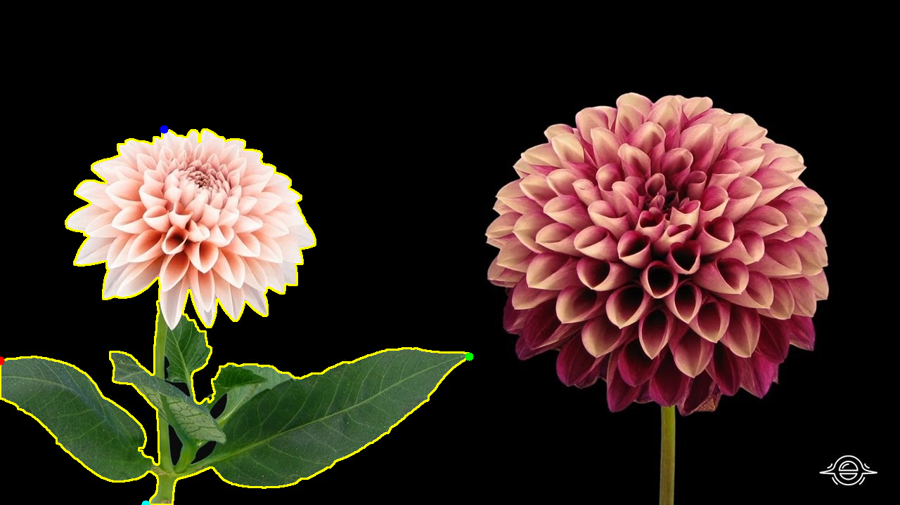
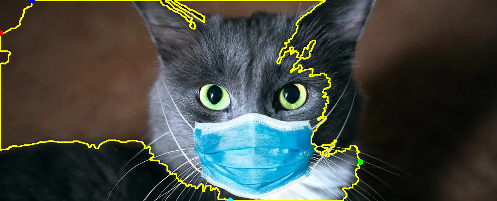

## Aim
This ObjectDetection module is for making object detection easy by providing area with maximum information.

### Tasks to be performed
1. * [ ]  Creating OpenCV module for detecting Area of Interest.
2. * [ ]  Creating Tensorflow module for detecting Area of Interest.
3. * [ ]  Comparing both.

**Task 1 :** Creating OpenCV module for detecting Area of Interest.

OpenCV_Highlighting is program to Highlights the area with maximum information. It initially does this by color intensity.

*Example :*

**Improvements to be done :**
1. Only one object is identified:

2. Include edge detection, as some part of object also not recognised:

